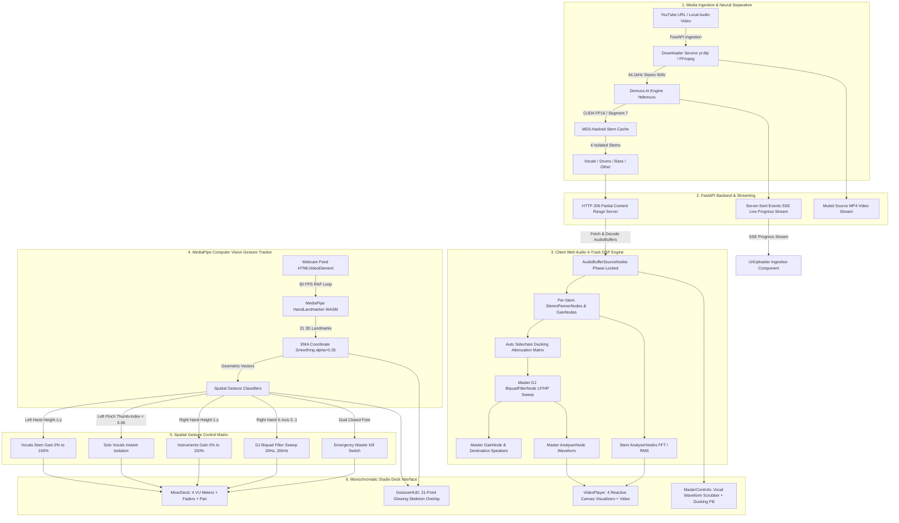

# 🎧 MusicOuts (WalkOuts Studio)

> **A Spatial Gesture-Controlled AI Music Workstation & Neural Stem Mixer powered by Demucs ML source separation, Web Audio API 4-track DSP, real-time vocal waveform analysis, auto sidechain ducking, and 60 FPS MediaPipe computer vision.**

[](LICENSE)
[](https://www.python.org/)
[](https://fastapi.tiangolo.com/)
[](https://react.dev/)
[](https://www.typescriptlang.org/)
[](https://tailwindcss.com/)
[](https://pytorch.org/)
[](https://developers.google.com/mediapipe)

---

## 🌟 Overview

**MusicOuts** transforms any song from a YouTube link or local audio/video file (`.mp3`, `.wav`, `.flac`, `.mp4`) into an interactive 4-stem live performance instrument. Powered by an NVIDIA CUDA-accelerated **Demucs HT (Hybrid Transformer)** neural pipeline, incoming audio is separated into **Vocals**, **Drums**, **Bass**, and **Other (Instruments)**.

Performers can dynamically mix, solo, mute, pan, and filter stems through **spatial hand gestures** captured in real-time via webcam, or through a high-contrast monochromatic DJ deck.

### ✨ Key Features
- 🧠 **Neural Stem Isolation**: Demucs `htdemucs` separation with FP16 precision, sub-segment windowing (`--segment 7`), and persistent MD5 disk caching.
- 🖐️ **60 FPS MediaPipe Spatial Vision**: 21 3D landmark skeleton tracking with Exponential Moving Average (EMA) smoothing for zero-latency gesture control.
- 🎛️ **Web Audio 4-Track DSP Engine**: Phase-locked 4-stem playback, click-free parameter interpolation, per-stem stereo pan/gain/analyser chains, and Master DJ Biquad filter (Lowpass/Highpass sweep).
- 🎙️ **Vocal Waveform Scrubber**: Canvas-rendered audio peak overview generated from decoded vocal buffer data with played/unplayed progress shading and live hover seeking.
- 🦆 **Auto Sidechain Ducking**: Real-time vocal RMS power detector that automatically attenuates backing instruments by **$-9\text{ dB}$ ($0.35\times$)** with smooth $20\text{ ms}$ attack and $200\text{ ms}$ release, with interactive toggle pill & dB reduction telemetry.
- 🌌 **Audio-Reactive Visualizer Stage**: 4 switchable visualizer modes:
  1. *Stacked Frequency Bars with Peak Hold*
  2. *Radial Circular Spectrum with Dynamic Bass Pulse Core*
  3. *Time-Domain Waveform Oscilloscope Beam*
  4. *Dedicated High-Definition Mirrored Vocal Waveform Stage*
- 🖤 **Monochromatic Theme**: Ultra-clean `#060608` obsidian dark mode with graphite card panels, hairline zinc borders, and high-contrast stark white/silver controls.

---

## 🏗️ Architecture & System Data Flow



---

## 🖐️ Gesture Control Reference Manual

| Hand / Gesture | Action | Target Parameter | Range / Behavior |
|---|---|---|---|
| **Left Hand Vertical Height** | Raise / lower left palm | **Vocals Volume** | $0\% \dots 150\%$ gain ($-\infty \text{ dB} \dots +3.5\text{ dB}$) |
| **Left Hand Pinch** | Thumb tip to index tip ($< 0.06$) | **Solo Vocals** | Instantly isolates vocals; mutes drums, bass, and other |
| **Right Hand Vertical Height** | Raise / lower right palm | **Instruments Volume** | Modulates Drums, Bass, and Other levels ($0\% \dots 150\%$) |
| **Right Hand X-Axis (Left)** | Move right hand to the left ($x < 0.45$) | **Low-Pass Filter Sweep** | Low-pass filter cut from $200\text{ Hz} \dots 20\text{ kHz}$ |
| **Right Hand X-Axis (Center)** | Hold right hand in middle ($0.45 \le x \le 0.55$) | **Neutral Bypass** | Flat frequency response (20 kHz lowpass bypass) |
| **Right Hand X-Axis (Right)** | Move right hand to the right ($x > 0.55$) | **High-Pass Filter Sweep** | High-pass filter cut from $20\text{ Hz} \dots 5\text{ kHz}$ |
| **Dual Closed Fists** | Clench both hands simultaneously | **Master Kill Switch** | Emergency instant mute across all master channels |

---

## ⚡ Hardware Optimizations (NVIDIA RTX 2050 / 4GB VRAM)

MusicOuts is tuned to run smoothly on consumer laptop/desktop GPUs (such as the **NVIDIA GeForce RTX 2050 4GB VRAM** with **8GB RAM**):

1. **Demucs FP16 CUDA Autocasting**:
   - Executes PyTorch `torch.cuda.amp.autocast()` with `htdemucs`.
   - `--segment 7` windowing cuts peak inference memory from ~3.8GB down to **~600MB - 1.2GB VRAM**, completely eliminating CUDA OOM errors.
2. **Client-Side MediaPipe Vision**:
   - Hand landmark detection runs 100% in the client browser via WebAssembly & WebGL at **60 FPS**, leaving the GPU dedicated to audio ML.
3. **MD5-Based Stem Caching**:
   - Repeated YouTube URLs or audio uploads resolve in `< 10ms` from disk cache.
4. **Anti-Click Audio Scheduling**:
   - DSP volume, mute, pan, and filter transitions utilize $30\text{ms}$ linear audio parameter ramps to prevent audible digital pops.

---

## 🚀 Quickstart & Installation

### Prerequisites
- **Operating System**: Windows 10/11, macOS, or Linux
- **GPU**: NVIDIA GPU with CUDA support (or CPU fallback)
- **Python**: Python 3.10 – 3.12
- **Node.js**: Node.js v18+ (tested on Node v22.13.1)
- **FFmpeg**: Installed and in system PATH

---

### Step 1: Clone Repository

```bash
git clone https://github.com/Skryyyyyy/MusicOuts.git
cd MusicOuts
```

### Step 2: Setup Python Backend

```powershell
# Create virtual environment (Windows)
python -m venv .venv
.venv\Scripts\Activate.ps1

# Install backend dependencies
pip install -r backend/requirements.txt
```

### Step 3: Setup React Frontend

```powershell
cd frontend
npm install
cd ..
```

---

### Step 4: Launch the Studio

#### Option 1: Start Backend Server
```powershell
.venv\Scripts\python.exe backend/run_backend.py
```
> Backend starts at **`http://127.0.0.1:8000`** (Swagger docs available at **`http://127.0.0.1:8000/docs`**).

#### Option 2: Start Frontend Dev Server
```powershell
npm --prefix frontend run dev
```
> Open your browser at **`http://localhost:3000`**.

---

## 🧪 Automated Test Suites

MusicOuts has comprehensive unit and end-to-end test coverage.

### Backend Pytest Suite (22 Tests)
```powershell
.venv\Scripts\python.exe -m pytest backend/tests/ -v
```
```
backend/tests/test_api.py ..................... [ 40%]
backend/tests/test_downloader.py .............. [ 68%]
backend/tests/test_e2e_pipeline.py ............ [ 72%]
backend/tests/test_health.py .................. [ 81%]
backend/tests/test_separator.py ............... [100%]
======================= 22 passed in 15.19s =======================
```

### Frontend Vitest Suite (49 Tests)
```powershell
npm --prefix frontend run test -- --run
```
```
 ✓ src/engine/gestureTracker.test.ts (23 tests)
 ✓ src/components/uiComponents.test.ts (9 tests)
 ✓ src/engine/audioGraph.test.ts (17 tests)
======================= 49 passed in 6.52s =======================
```

### Production Build Verification
```powershell
npm --prefix frontend run build
```
```
✓ 1590 modules transformed.
dist/index.html                   0.89 kB
dist/assets/index-B20KSQ5p.css   24.40 kB
dist/assets/index-BOHYe9v5.js   342.95 kB
✓ built in 5.50s
```

---

## 📡 REST & Streaming API Reference

| Method | Endpoint | Description |
|---|---|---|
| `GET` | `/api/health` | Health status and CUDA GPU hardware detection |
| `POST` | `/api/process/youtube` | Ingest and demix audio from YouTube URL |
| `POST` | `/api/process/upload` | Ingest and demix local MP3, WAV, FLAC, MP4 files |
| `GET` | `/api/process/status/{task_id}` | Live Server-Sent Events (SSE) progress stream |
| `GET` | `/api/process/{task_id}/events` | SSE progress stream alias |
| `GET` | `/api/process/info/{track_id}` | Track metadata, stem URLs, and video URL |
| `GET` | `/api/media/stems/{track_id}/{stem_name}` | HTTP 206 partial range streaming for WAV stems |
| `GET` | `/api/media/{track_id}/{stem_name}` | Direct stem audio endpoint |
| `GET` | `/api/media/video/{track_id}` | HTTP 206 video stream for synchronized playback |
| `GET` | `/api/media/{track_id}/video` | Direct video stream endpoint |

---

## 🎨 Studio Components

- **`GestureHUD`**: Webcam canvas rendering a 21-point skeleton overlay with EMA coordinate smoothing, mirror flip toggle, and live gesture telemetry badges.
- **`MixerDeck`**: 4 vertical stem channel strips with white LED VU meters, level faders, stereo pan, Solo/Mute toggles, Master bus, and DJ Biquad filter frequency track.
- **`VideoPlayer`**: Phase-locked video player with 4 reactive visualizer modes (*Bars*, *Radial Spectrum*, *Oscilloscope Beam*, and *Dedicated Vocal Waveform*).
- **`MasterControls`**: Transport controls (Play/Pause, Rewind, Loop), full decoded **Vocal Waveform Scrubber**, **Auto Sidechain Ducking** toggle with live dB reduction badge, and hardware telemetry.
- **`UrlUploader`**: YouTube URL input, local audio/video file drag-and-drop zone, sample presets, and SSE live progress bar.

---

## 📜 License & Credits

- **License**: MIT License
- **Neural Separation**: Meta AI Research ([Demucs](https://github.com/facebookresearch/demucs))
- **Vision Tracking**: Google AI ([MediaPipe Tasks Vision](https://developers.google.com/mediapipe))
- **Icons**: [Lucide React](https://lucide.dev)
