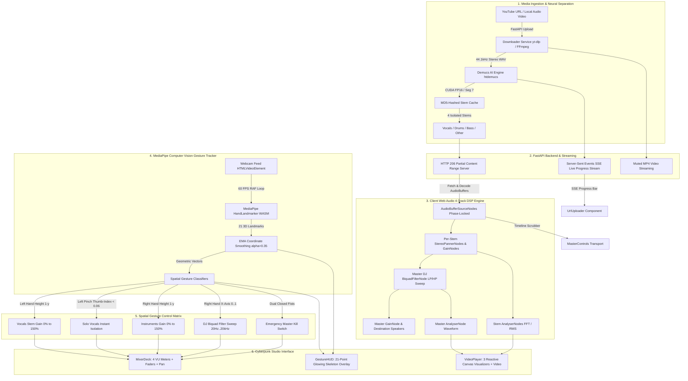

# 🎧 WalkOuts — Spatial Gesture-Controlled Music Stem Mixer & Visualizer

> **A next-generation AI music production & performance workstation powered by Demucs neural source separation, Web Audio API 4-track DSP, and 60 FPS MediaPipe computer vision hand tracking.**

---

## 🌟 Overview

**WalkOuts** transforms any song from a YouTube link or audio/video upload into an interactive 4-stem live performance instrument. Using PyTorch CUDA Demucs AI on your GPU, audio is separated into **Vocals**, **Drums**, **Bass**, and **Other (Instruments)**. 

Control individual stems and DJ filters effortlessly through **spatial hand gestures** captured via your webcam or manual tactile studio deck controls — all phase-locked to muted source video with real-time audio-reactive canvas visualizers.

---

## 🏗️ Architecture & System Data Flow



---

## 🖐️ Gesture Control Reference Manual

| Hand / Gesture | Action | Target Parameter | Range / Behavior |
|---|---|---|---|
| **Left Hand Vertical Height** | Raise / lower left palm | **Vocals Volume** | $0\% \dots 150\%$ gain ($-\infty \text{ dB} \dots +3.5\text{ dB}$) |
| **Left Hand Pinch** | Thumb tip to index tip ($< 0.06$) | **Solo Vocals** | Instantly isolates vocals; mutes drums, bass, and other |
| **Right Hand Vertical Height** | Raise / lower right palm | **Instruments Volume** | Modulates Drums, Bass, and Other levels ($0\% \dots 150\%$) |
| **Right Hand X-Axis (Left)** | Move right hand to the left ($x < 0.45$) | **Low-Pass Filter Sweep** | Low-pass filter cut from $200\text{ Hz} \dots 20\text{ kHz}$ |
| **Right Hand X-Axis (Center)** | Hold right hand in middle ($0.45 \le x \le 0.55$) | **Neutral Bypass** | Flat frequency response (20 kHz lowpass bypass) |
| **Right Hand X-Axis (Right)** | Move right hand to the right ($x > 0.55$) | **High-Pass Filter Sweep** | High-pass filter cut from $20\text{ Hz} \dots 5\text{ kHz}$ |
| **Dual Closed Fists** | Clench both hands simultaneously | **Master Kill Switch** | Emergency instant mute on all channels |

---

## ⚡ Hardware Optimizations (NVIDIA RTX 2050 4GB VRAM)

WalkOuts is engineered specifically to maximize performance on laptop/desktop GPUs like the **NVIDIA GeForce RTX 2050 (4GB VRAM)** and **8GB RAM**:

1. **Demucs CUDA FP16 Inference**:
   - Uses PyTorch `torch.cuda.amp.autocast()` with Demucs `htdemucs`.
   - `--segment 7` window chunks reduce peak inference VRAM from 3.8GB down to **~600MB - 1.2GB**, completely preventing CUDA Out-Of-Memory (OOM) crashes.
2. **Client-Side MediaPipe Vision**:
   - Hand tracking executes 100% in-browser via WebAssembly / WebGL delegates at a stable **60 FPS**, leaving the GPU entirely dedicated to audio ML.
3. **MD5-Based Persistent Caching**:
   - Duplicate tracks (YouTube or uploads) resolve in `< 10ms` from the stem cache without re-running separation.
4. **Zero Audio Glitch DSP**:
   - All parameter modulations (faders, mutes, pan, DJ sweeps) utilize $30\text{ms}$ linear/exponential Web Audio scheduling ramps to eliminate acoustic pops and clicks.

---

## 🚀 Quickstart & Installation

### Prerequisites
- **OS**: Windows 10/11 (or Linux/macOS)
- **GPU**: NVIDIA GPU with CUDA support (e.g. RTX 2050, 3060, etc.)
- **Python**: Python 3.10 – 3.12
- **Node.js**: Node.js v18+ (tested on Node v22.13.1)
- **FFmpeg**: Installed and available in PATH (or bundled with `yt-dlp` / imageio)

---

### Step 1: Clone Repository & Setup Backend

```powershell
# Navigate to project directory
cd C:\SkryyyProjects\WalkOuts

# Activate the virtual environment
.venv\Scripts\Activate.ps1

# Install backend dependencies (if not already installed)
pip install -r backend/requirements.txt
```

### Step 2: Setup Frontend

```powershell
cd frontend
npm install
cd ..
```

---

### Step 3: Run the Application

#### Option A: Run Backend Server
```powershell
.venv\Scripts\python.exe backend/run_backend.py
# Backend runs at http://127.0.0.1:8000 (API Docs at http://127.0.0.1:8000/docs)
```

#### Option B: Run Frontend Dev Server
```powershell
npm --prefix frontend run dev
# Frontend runs at http://localhost:3000 (proxies /api to http://127.0.0.1:8000)
```

Open your browser at **`http://localhost:3000`**.

---

## 🧪 Automated Test Suites

WalkOuts maintains full automated test coverage across both backend and frontend.

### Run Backend Pytest Suite (22 Tests)
```powershell
.venv\Scripts\python.exe -m pytest backend/tests -v
```
```
backend/tests/test_api.py ..................... [ 40%]
backend/tests/test_downloader.py .............. [ 68%]
backend/tests/test_e2e_pipeline.py ............ [ 72%]
backend/tests/test_health.py .................. [ 81%]
backend/tests/test_separator.py ............... [100%]
======================= 22 passed in 15.87s =======================
```

### Run Frontend Vitest Suite (45 Tests)
```powershell
npm --prefix frontend run test
```
```
 ✓ src/engine/gestureTracker.test.ts (23 tests)
 ✓ src/engine/audioGraph.test.ts (13 tests)
 ✓ src/components/uiComponents.test.ts (9 tests)
======================= 45 passed in 2.33s =======================
```

### Run Production Build Verification
```powershell
npm --prefix frontend run build
```
```
✓ 1590 modules transformed.
dist/index.html                   0.89 kB
dist/assets/index-Dj7mKH2j.css   27.77 kB
dist/assets/index-CqHlBHfz.js   337.40 kB
✓ built in 6.68s
```

---

## 📡 REST & Streaming API Reference

| Method | Endpoint | Description |
|---|---|---|
| `GET` | `/api/health` | System health check and CUDA GPU detection |
| `POST` | `/api/process/youtube` | Ingest and demix audio from YouTube URL |
| `POST` | `/api/process/upload` | Ingest and demix local MP3, WAV, FLAC, MP4 files |
| `GET` | `/api/process/status/{task_id}` | Live Server-Sent Events (SSE) progress stream |
| `GET` | `/api/process/info/{track_id}` | Track metadata, stem URLs, and video URL |
| `GET` | `/api/media/stems/{track_id}/{stem_name}` | HTTP 206 partial range streaming for WAV stems |
| `GET` | `/api/media/video/{track_id}` | HTTP 206 video stream for synchronized video playback |

---

## 🎨 UI Component Suite

- **`GestureHUD`**: Real-time webcam canvas with 21-joint skeleton glowing overlay, FPS readout, mirror mode, and gesture telemetry badges.
- **`MixerDeck`**: 4 vertical channel strips with 60 FPS RMS VU meters, volume sliders, stereo pan, Solo/Mute buttons, Master bus, and DJ Biquad filter frequency track.
- **`VideoPlayer`**: Synchronized muted source video player + 3 audio-reactive visualizers:
  1. *4-Channel Stacked Frequency Bars with Peak Hold*
  2. *Radial Circular Spectrum with Dynamic Bass Pulse Core*
  3. *Time-Domain Waveform Oscilloscope Beam*
- **`UrlUploader`**: Drag-and-drop file upload zone, YouTube URL field, sample track presets, and live SSE separation progress meter.
- **`MasterControls`**: Master transport (Play/Pause, Rewind, Loop), seek scrubber timeline bar, and Demucs CUDA GPU accelerator badge.

---

## 📜 License & Acknowledgments

- **Demucs**: Meta AI Research (`htdemucs` architecture)
- **MediaPipe**: Google AI (`@mediapipe/tasks-vision`)
- **Icons**: Lucide React
- **Built with**: Antigravity SDD Pair Programming Framework
