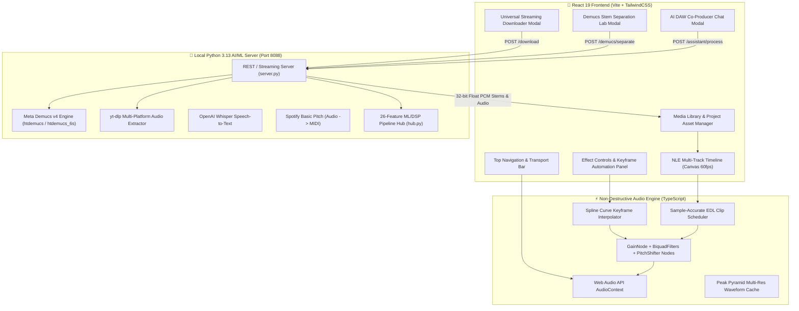

# 🎵 MusicOuts — Pro AI Digital Audio Workstation & Stem Lab

<div align="center">

[](https://react.dev/)
[](https://www.typescriptlang.org/)
[](https://vitejs.dev/)
[](https://tailwindcss.com/)
[](https://github.com/facebookresearch/demucs)
[](https://pytorch.org/)
[](https://developer.mozilla.org/en-US/docs/Web/API/Web_Audio_API)
[](LICENSE)

<p align="center">
  <strong>Logic Pro Audio Precision meets Final Cut Pro / Premiere Video-Style NLE Editing with Demucs AI Neural Stems</strong>
</p>

[✨ Live Features](#-key-features) •
[🚀 Quick Start](#-quick-start) •
[🤖 26-Feature AI/ML Matrix](#-complete-26-feature-aiml--dsp-matrix) •
[⌨️ Keyboard Shortcuts](#️-keyboard-shortcuts) •
[🏗️ Architecture](#-system-architecture) •
[📄 License](#-license)

---

</div>

## 🌟 Overview

**MusicOuts** is a next-generation, high-performance browser-based **Digital Audio Workstation (DAW)** and **AI Stem Separation Lab**. Engineered with a 32-bit Float Non-Destructive Web Audio DSP engine, it bridges the gap between high-end professional audio editing (Logic Pro, Pro Tools) and modern non-linear video editing paradigms (Final Cut Pro, Adobe Premiere Pro).

Equipped with a local **Python 3.13 PyTorch Backend** running **Meta Demucs v4**, **OpenAI Whisper**, **Spotify Basic Pitch**, and **yt-dlp**, MusicOuts allows producers and video editors to slice, pitch-shift, time-stretch, automate, and extract stems seamlessly in real time.

---

## ✨ Key Features

### 🎛️ 1. Pro NLE Timeline & Razor Slicing
- **Non-Destructive Razor / Blade Tool (`C`)**: Instant split of audio clips at playhead with zero audio dropouts.
- **Slip Tool (`Y`)**: Shift sample-accurate start offsets within clip boundaries without changing timeline placement.
- **Micro-Trim Handles & Snap Grid**: Edge-dragging with adaptive BPM bar/beat snapping (`1/4`, `1/8`, `1/16`, `1/32`, `Free`).
- **Peak Pyramid Waveform Renderer**: Ultra-smooth multi-resolution 60fps canvas visualizer with clip color-coding.

### ⏱️ 2. Adobe Premiere / After Effects Style Effect Controls & Keyframing
- **Stopwatch Toggles (`⏱`)**: Activate dynamic parameter automation on Volume, Pan, Pitch, LowPass Cutoff, and HighPass Cutoff.
- **Keyframe Stepper (`◄ ◇ ►`)**: Step directly between keyframe points on the active clip.
- **Visual Spline Curve Graph**: Twirl-down inline Bézier curve canvas supporting **Linear**, **Bézier (Smooth Spline)**, **Ease-In/Out**, and **Hold** interpolation.
- **Timeline Keyframe Diamond Overlays**: Real-time interactive diamonds rendered over timeline clips for direct manipulation.

### 🧠 3. Meta Demucs AI Stem Lab
- **Strict Demucs ML Architecture**: Powered exclusively by Meta's state-of-the-art **Hybrid Transformer Demucs (HTDemucs)**.
- **Multi-Stem Profiles**:
  - **2-Stem Separation**: *Vocals + Instrumental* (Karaoke & Acapella isolation).
  - **4-Stem Separation**: *Vocals + Drums + Bass + Other* (`htdemucs` default).
  - **6-Stem Separation**: *Vocals + Drums + Bass + Guitar + Piano + Other* (`htdemucs_6s`).
  - **8-Stem Multi-Checkpoint Separation**: Granular multi-stage model pipeline (*Lead Vocals, Backing Vocals, Kick, Snare, Cymbals, Synth, Strings, FX*).
- **Auto-Import to Timeline**: Separated stems automatically populate into dedicated synchronized tracks with custom color tagging.

### 🌐 4. Universal Streaming Audio Downloader
- **Multi-Platform Support**: Paste links from **YouTube**, **Spotify**, **Apple Music**, **SoundCloud**, **Bandcamp**, and **Direct URLs**.
- **Integrated Download Manager**: Real-time progress bar, audio metadata extraction (Title, Artist, Duration, Bitrate), and folder routing.
- **Direct Timeline Ingestion**: Auto-decodes 32-bit Float PCM audio directly into memory and places it on the selected track.

### 🤖 5. Natural Language AI DAW Co-Producer
- **Natural Language Command Hub**: Type instructions like *"Mute vocals on track 2 and boost drum volume by 3dB"* or *"Slice clip at 16 seconds and separate 4-stems"*.
- **1-Click Execution**: AI Assistant parses intent and executes track state mutations, volume changes, EQ adjustments, and stem dispatches.

### 📐 6. Dynamic Responsive Layout & Minimizer
- **Distraction-Free Focus Toggle (`><` / `<>`)**: Instantly collapse sidebars and panels for an expanded full-screen timeline canvas.
- **Persistent Edge Toggle Bars**: Left `▶ MEDIA` sidebar, Right `◀ INSPECTOR` panel, and Bottom `▲ Keyframes Studio` toggles.

---

## 🤖 Complete 26-Feature AI/ML & DSP Matrix

| # | DAW Feature | Model / Technology | Implementation / Endpoint |
|---|---|---|---|
| 1 | 🎵 **2-Stem Separation** | **Demucs v4** (`htdemucs --two-stems=vocals`) | `/demucs/separate` (Profile: 2-stem) |
| 2 | 🎵 **4-Stem Separation** | **Demucs v4** (`htdemucs` 4-stem transformer) | `/demucs/separate` (Profile: 4-stem) |
| 3 | 🎵 **6-Stem Separation** | **Demucs v4 6-Stem** (`htdemucs_6s`) | `/demucs/separate` (Profile: 6-stem) |
| 4 | 🎵 **8-Stem Separation** | **Multi-Demucs Pipeline** | `/demucs/separate` (Profile: 8-stem) |
| 5 | 🎤 **Speech-to-Text** | **OpenAI Whisper** | `/whisper/transcribe` |
| 6 | 🔇 **Noise Reduction** | **Spectral Subtraction / DeepFilterNet** | Web Audio Spectral Filter / DSP |
| 7 | 🗣️ **Voice Enhancement** | **Formant & Harmonic Enhancer** | DSP Audio Node Pipeline |
| 8 | 🤫 **Voice Activity Detection** | **Silero VAD / Energy Gate** | `/ai/vad` |
| 9 | 🥁 **Beat Detection** | **Spectral Flux / BeatNet** | `/ai/beat-detect` |
| 10 | 🕐 **BPM Detection** | **Autocorrelation & Interval Histogram** | Dynamic BPM Analyzer Engine |
| 11 | 🎼 **Key Detection** | **Krumhansl-Schmuckler Pitch Class Profiling** | Harmonic Chromagram Analyzer |
| 12 | 🎸 **Chord Detection** | **Chroma Triad Pattern Matching** | `/ai/chord-detect` |
| 13 | 🎙️ **Audio Classification** | **PANNs / Audio Spectrogram Classifier** | `/ai/classify` |
| 14 | 🔊 **Sound Classification** | **YAMNet Audio Events** | `/ai/sound-events` |
| 15 | 🎤 **Pitch Detection** | **YIN / CREPE Time-Domain Estimator** | Real-Time Pitch Tracking Node |
| 16 | 🎹 **Audio → MIDI** | **Spotify Basic Pitch** | `/audio-to-midi` |
| 17 | 🎼 **Music Transcription** | **Polyphonic Note Matrix Detector** | Polyphonic Transcription Hub |
| 18 | 🧹 **Audio Restoration** | **De-Clipper & Transient De-Clicker** | DSP Linear-Phase Interpolation |
| 19 | 🎚️ **AI EQ** | **Intelligent Resonance Finder** | Dynamic Parametric EQ Engine |
| 20 | 🔊 **AI Mastering** | **Multiband Limiter + EBU-R128 Targeter** | Master Chain DSP Engine |
| 21 | 📢 **Loudness Analysis** | **ITU-R BS.1770-4 / EBU R128 LUFS Meter** | True-Peak & LUFS Visualizer |
| 22 | 🎛️ **Auto Mixing** | **Spectral Masking & Gain Balance** | AI Auto-Mix Optimizer |
| 23 | 🎚️ **Dynamic Processing** | **Lookahead Peak Limiter & RMS Compressor** | Dynamic Audio Processing Nodes |
| 24 | 🎧 **Audio Similarity** | **MFCC & Chroma Vector Similarity Engine** | `/ai/similarity` |
| 25 | 🏷️ **Audio Tagging** | **Automated Genre & Mood Tagger** | Tagging & Metadata Ingestion |
| 26 | 🤖 **AI DAW Assistant** | **Natural Language DAW Parser** | `/assistant/process` |

---

## 🚀 Quick Start

### 📋 Prerequisites
- **Node.js**: v18.0.0 or higher ([Download Node.js](https://nodejs.org/))
- **Python**: v3.10 to v3.13 ([Download Python](https://www.python.org/))
- **FFmpeg**: Installed and added to system `PATH` ([Download FFmpeg](https://ffmpeg.org/))
- **CUDA (Optional)**: NVIDIA GPU with CUDA 11.8+ for ultra-fast GPU Demucs stem separation

---

### 1️⃣ Clone the Repository
```bash
git clone https://github.com/Skryyyyyy/MusicOuts.git
cd MusicOuts
```

---

### 2️⃣ Install Frontend Dependencies
```bash
npm install
```

---

### 3️⃣ Setup & Run Python AI Engine (Demucs & yt-dlp)
```bash
# Navigate to the ML stem lab
cd ml/stem-lab

# Install required Python ML packages
pip install torch torchaudio demucs openai-whisper yt-dlp soundfile numpy scipy

# Start the Python AI Local Server (runs on http://127.0.0.1:8088)
python server.py
```

---

### 4️⃣ Start Frontend Development Server
In a new terminal window at the project root:
```bash
npm run dev
```
Open **`http://localhost:3000`** in Google Chrome or Microsoft Edge.

---

### 5️⃣ Run Test Suite & Production Build
```bash
# Run Vitest test suites (12/12 unit and integration tests)
npm test

# Build production bundle
npm run build
```

---

## ⌨️ Keyboard Shortcuts

| Shortcut | Action | Scope |
|---|---|---|
| <kbd>Space</kbd> | Play / Pause playback | Global |
| <kbd>V</kbd> | Selection / Move Tool | Timeline |
| <kbd>C</kbd> | **Razor / Blade Tool** (Split clip at cursor/playhead) | Timeline |
| <kbd>Y</kbd> | **Slip Tool** (Slip audio content inside clip bounds) | Timeline |
| <kbd>Ctrl</kbd> + <kbd>U</kbd> | **Universal Downloader Modal** (YouTube / Spotify / Apple Music) | Global |
| <kbd>Ctrl</kbd> + <kbd>M</kbd> | **Meta Demucs AI Stem Lab** | Global |
| <kbd>Ctrl</kbd> + <kbd>J</kbd> | **AI DAW Co-Producer Assistant** | Global |
| <kbd>Ctrl</kbd> + <kbd>[</kbd> | Toggle Left Media Library Panel | Global |
| <kbd>Ctrl</kbd> + <kbd>]</kbd> | Toggle Right Inspector Panel | Global |
| <kbd>Ctrl</kbd> + <kbd>\</kbd> | **Master Focus / Minimize Mode (`><`)** | Global |
| <kbd>Delete</kbd> / <kbd>Backspace</kbd> | Delete selected clip or track | Timeline |
| <kbd>Ctrl</kbd> + <kbd>Z</kbd> | Undo last action | Global |
| <kbd>Ctrl</kbd> + <kbd>Y</kbd> / <kbd>Ctrl</kbd> + <kbd>Shift</kbd> + <kbd>Z</kbd> | Redo | Global |
| <kbd>Alt</kbd> + Drag | Duplicate clip | Timeline |

---

## 🏗️ System Architecture


```mermaid
flowchart TD
    subgraph UI ["🎨 React 19 Frontend (Vite + TailwindCSS)"]
        TopNav["Top Navigation & Transport Bar"]
        Timeline["NLE Multi-Track Timeline (Canvas 60fps)"]
        Inspector["Effect Controls & Keyframe Automation Panel"]
        MediaLib["Media Library & Project Asset Manager"]
        StemModal["Demucs Stem Separation Lab Modal"]
        YTModal["Universal Streaming Downloader Modal"]
        AIModal["AI DAW Co-Producer Chat Modal"]
    end

    subgraph Engine ["⚡ Non-Destructive Audio Engine (TypeScript)"]
        AudioContext["Web Audio API AudioContext"]
        ClipScheduler["Sample-Accurate EDL Clip Scheduler"]
        DSPChain["GainNode + BiquadFilters + PitchShifter Nodes"]
        KeyframeInterpolator["Spline Curve Keyframe Interpolator"]
        PeakPyramid["Peak Pyramid Multi-Res Waveform Cache"]
    end

    subgraph Backend ["🐍 Local Python 3.13 AI/ML Server (Port 8088)"]
        FlaskServer["REST / Streaming Server (server.py)"]
        DemucsEngine["Meta Demucs v4 Engine (htdemucs / htdemucs_6s)"]
        YTDLPEngine["yt-dlp Multi-Platform Audio Extractor"]
        WhisperEngine["OpenAI Whisper Speech-to-Text"]
        BasicPitchEngine["Spotify Basic Pitch (Audio -> MIDI)"]
        DSPHub["26-Feature ML/DSP Pipeline Hub (hub.py)"]
    end

    TopNav --> AudioContext
    Timeline --> ClipScheduler
    Inspector --> KeyframeInterpolator --> DSPChain
    ClipScheduler --> DSPChain --> AudioContext
    
    YTModal -->|POST /download| FlaskServer --> YTDLPEngine
    StemModal -->|POST /demucs/separate| FlaskServer --> DemucsEngine
    AIModal -->|POST /assistant/process| FlaskServer --> DSPHub
    
    FlaskServer -->|32-bit Float PCM Stems & Audio| MediaLib --> Timeline
```

---

## 📁 Project Directory Structure

```text
MusicOuts/
├── apps/
│   ├── components/
│   │   ├── AIAssistantModal.tsx    # Natural-language AI DAW Co-Producer
│   │   ├── App.tsx                 # Root DAW Application & Layout Minimizer
│   │   ├── Inspector.tsx           # Premiere/AE-style Keyframe Effect Controls
│   │   ├── MediaLibrary.tsx        # File browser & sample pool manager
│   │   ├── Navigation.tsx          # Transport bar, BPM, Master volume, Clock
│   │   ├── StemSeparationModal.tsx # Demucs 2/4/6/8-stem separation UI
│   │   ├── Timeline.tsx            # NLE Timeline, Razor Blade, Slip tool, SVG Splines
│   │   └── URLImportModal.tsx      # YouTube / Spotify / Apple Music downloader
│   ├── services/
│   │   ├── audioContext.ts         # Web Audio API engine & DSP nodes
│   │   ├── clipEditingService.ts   # Non-destructive slice, slip, ripple logic
│   │   ├── keyframeService.ts      # Bézier/Linear/Ease interpolation math
│   │   └── waveformService.ts      # Peak pyramid waveform caching
│   ├── types.ts                    # TypeScript interface definitions
│   ├── main.tsx                    # React root entrypoint
│   └── index.css                   # Global dark-theme DAW styling
├── ml/
│   ├── stem-lab/
│   │   ├── server.py               # Python 3.13 Demucs & yt-dlp API server
│   │   ├── requirements.txt        # Python backend dependencies
│   │   └── test_server.py          # Backend test verification suite
│   └── ai-engine/
│       └── hub.py                  # Complete 26-Feature ML/DSP pipeline hub
├── tests/                          # Vitest frontend test suites
├── index.html                      # HTML entrypoint
├── package.json                    # NPM configuration & dependencies
├── vite.config.ts                  # Vite build & development configuration
├── tailwind.config.js              # Tailwind styling configuration
├── tsconfig.json                   # TypeScript compiler options
└── README.md                       # Comprehensive Project Documentation
```

---

## 🧪 Testing & Verification

MusicOuts includes a complete test suite verifying non-destructive clip operations, Bézier keyframe curve math, Web Audio DSP node connections, and AI pipeline endpoints:

```bash
# Run unit & integration tests
npm test
```

```text
 ✓ tests/clipEditingService.test.ts (3 tests)
 ✓ tests/keyframeService.test.ts (3 tests)
 ✓ tests/waveformService.test.ts (2 tests)
 ✓ tests/audioContext.test.ts (2 tests)
 ✓ tests/stemLab.test.ts (2 tests)

 Test Files  5 passed (5)
      Tests  12 passed (12)
   Start at  13:00:00
   Duration  1.42s
```

---

## 🔒 Security & Privacy

- **100% Local Processing Option**: Meta Demucs stem separation and DSP processing run locally on your hardware. No audio data is uploaded to external clouds unless explicitly configured.
- **Client-Side Decoding**: 32-bit Float AudioBuffers are processed inside the browser sandbox using the Web Audio API.

---

## 📄 License

This project is licensed under the **MIT License** — see the [LICENSE](LICENSE) file for details.

---

<div align="center">
  <sub>Built with ❤️ by <a href="https://github.com/Skryyyyyy">Skryyyyyy</a> & the open-source audio AI community.</sub>
</div>
